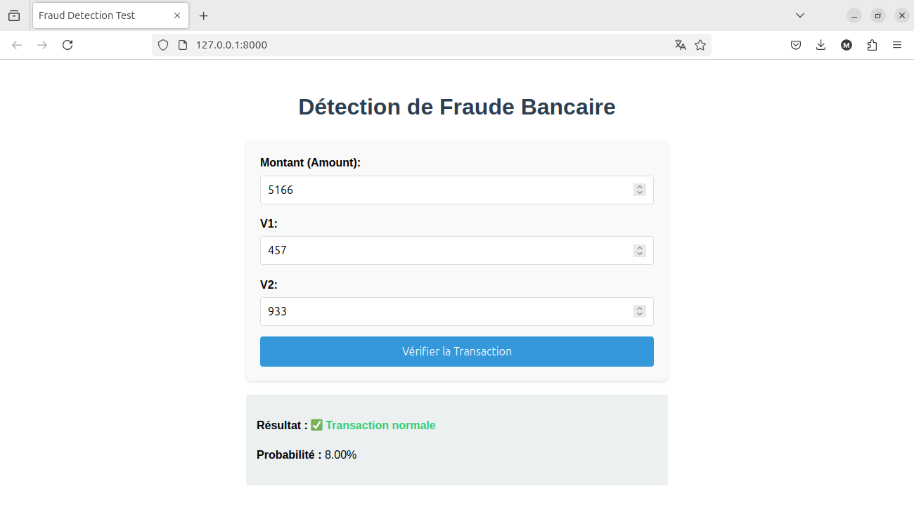

# 💳 Fraud Detection System

An end-to-end machine learning system for detecting credit card fraud transactions, with a Flask API backend and web interface.

 *Example interface showing fraud detection results*

## 🛠️ Technical Implementation

### Backend & Machine Learning (Solo Work)
- **Data Processing**:
  - Handled class imbalance using SMOTE and Random Under-Sampling
  - Feature scaling with StandardScaler (persisted for inference)
- **Model Training**:
  - Compared Logistic Regression, Random Forest and XGBoost
  - Selected Random Forest (best F1-score: 0.91)
  - Serialized model and scaler using pickle
- **API Development**:
  - Built Flask server with two endpoints:
    - `GET /` - Serves the frontend
    - `POST /predict` - Handles fraud predictions
  - CORS configuration for cross-origin requests
  - Docker containerization

### Frontend (Contributed by Deepsick)
- Clean responsive interface with form validation
- Dynamic result display with visual feedback
- Error handling and loading states
- Modern CSS styling

## 🚀 Installation & Usage

### Prerequisites
- Python 3.9+
- Docker (optional)

### Running Locally
```bash
# Install dependencies
pip install -r requirements.txt

# Train model (generates model.pkl and scaler.pkl)
python src/train.py

# Start Flask server
python src/app.py 
```

### With Docker
```
docker build -t fraud-detection .
docker run -p 8000:8000 fraud-detection
```
## 🚀 Déploiement sur Render (Docker)

### 📝 Mes notes perso :
- **Lien de l'API** : `[https://fraud-detection.onrender.com](https://fraud-detection-vhwx.onrender.com/)`  
- **Config Docker** : Le fichier `Dockerfile` présent dans le repo a fonctionné sans modif  
- **Variables d'environnement** :  
  - `PORT=8000` (doit matcher avec `app.py`)  
- **Problèmes rencontrés** :  
  - Le frontend plantait car j'avais oublié `CORS(app)` dans `app.py`  
  - Premier déploiement lent (~8 min) car Render build l'image Docker  

### 🔄 Commandes utiles :
```bash
# Redéployer après un changement :
git push origin main  # Render rebuild automatiquement

# Voir les logs en temps réel :
1. Aller sur Render.com → Mon service → Onglet "Logs"
```
## Notes
- The frontend interface was collaboratively developed with DEEPSICK.
